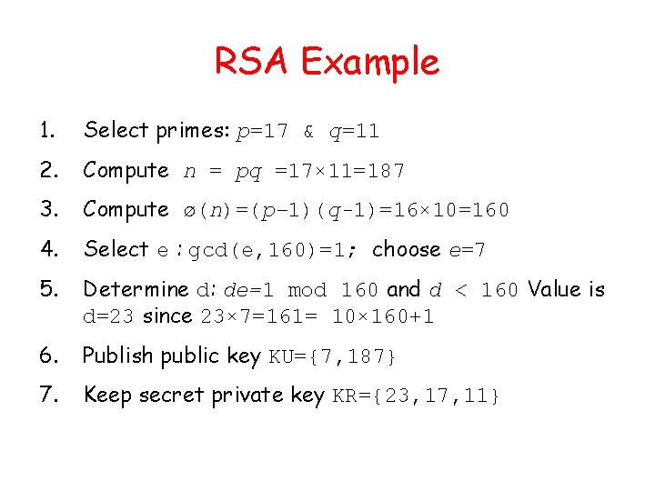

# RSA (Hard)

<figure><figcaption></figcaption></figure>

Prior to this challenge, even though I have heard of RSA before, I knew nothing about it. I researched it online and used the Cyber Skyline Video to help me.&#x20;

But to explain, in RSA, there's 2 prime numbers: p and q. These are the two big, random prime numbers, and essentially the secret/solution for most CTFs.

&#x20;n is the modulus, which is listed in the screenshot above. n is the factor of p and q. Next is the tricky one, Euler's totient (φ). By Wikipedia defintion: "Euler's totient function counts the positive integers up to a given integer n that are relatively prime to n.&#x20;

Or in otherwords, φ(n) counts the amount of numbers that don't share a factor with n. For example φ(10) would return 4, because every even number would be removed, and 5 would be a factor of 10. Hence, 9-5 = 4. (We don't count n itself, making it not 10).&#x20;

***

But back to the funky variables, d and e are both derived from p and q through various mathematical functions that I won't go too in depth.&#x20;

<figure><figcaption></figcaption></figure>

But back to the CTF, there's separate operations for deencyrpting and encyrpting. "n" and "e" are the public key, and "d" "p" "q" are the private key. If you then use the public key to encript some cipher text, you get c. c is the encrypted message everyone could see, but only the person with the private key could decrypt it. "nec" is public.&#x20;

### Cracking It

I'll use this website to help me guide cracking it: [https://www.tausquared.net/pages/ctf/rsa.html](https://www.tausquared.net/pages/ctf/rsa.html)

Most of cracking it just figuring it out what RSA was, so it was pretty simple from here. From prime factors calculators online, I figured p = 13 and q = 83. With that, I plugged in to this code provided:

Using this code provided by Skyline:

```
import gmpy2

e = 43
p = 13
q = 83
n = p*q

c = [996, 894, 379, 631, 894, 82, 379, 852, 631, 677, 677, 194, 893]
phi = (p-1)*(q-1)

d = gmpy2.invert(e, phi)
print(d)

message = ""
for i in c:
    m = pow(i, d, n)
    message += chr(m)

print(message)
```

From a CTF blog this would also be an example:

```
#!/usr/bin/env python3

from Crypto.Util.number import long_to_bytes

if __name__ == "__main__":
    c = 8533139361076999596208540806559574687666062896040360148742851107661304651861689
    p = 1617549722683965197900599011412144490161
    q = 475693130177488446807040098678772442581573
    n = p * q
    e = 65537

    phi = (p - 1) * (q - 1)
    d = pow(e, -1, phi)
    m = pow(c, d, n)
    pt = long_to_bytes(m).decode()

    print(pt)
```

