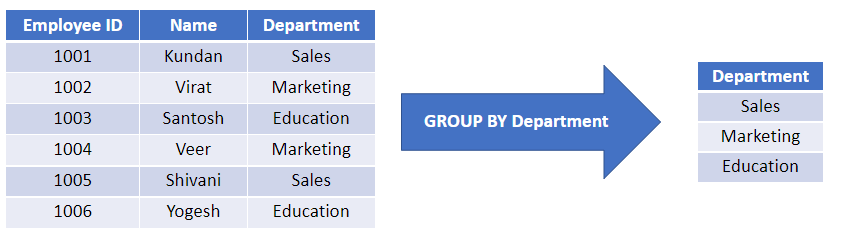

# Joins and More Queries

The past few lessons has been centered around an single table. However, what would we do with numerous tables (normalization)&#x20;

> Database normalization is useful because it minimizes duplicate data in any single table, and allows for data in the database to grow independently of each other (ie. Types of car engines can grow independent of each type of car). As a trade-off, queries get slightly more complex since they have to be able to find data from different parts of the database, and performance issues can arise when working with many large table

The problem currently, is that instead of putting all of the data in one big table, sometime databases split it into multiple smaller tables. Hence, you would then use the statement "JOIN" to connect them.  (INNER JOIN and JOIN are the same)

**Example:** Imagine you have two tables:

* **Table 1:** Customer names and their ID numbers
* **Table 2:** Orders and which customer ID placed them

```
SELECT what_you_want
FROM first_table
INNER JOIN second_table
ON first_table.id = second_table.id

###EXAMPLE###
SELECT title, domestic_sales,international_sales FROM movies
INNER JOIN boxoffice 
ON movies.id = boxoffice.Movie_id

SELECT title, rating FROM movies
INNER JOIN boxoffice 
ON movies.id = boxoffice.Movie_id
order by rating desc 
```

### Outer Joins

However, the issue with inner joins that it only shows rows that matches in both rows. In other words, if something exists in one table only, it gets left out completely. The solution is OUTER JOINS, which fill in blanks with NULLS when there is no match.

| JOINS      | Purpose                                                                                                                                                                                                                                                                                                                                                                                                                       |
| ---------- | ----------------------------------------------------------------------------------------------------------------------------------------------------------------------------------------------------------------------------------------------------------------------------------------------------------------------------------------------------------------------------------------------------------------------------- |
| LEFT JOINS | <p></p><p><strong>1. LEFT JOIN</strong></p><ul><li>Keeps ALL rows from the first (left) table</li><li>Adds matching data from the second table where available</li><li>If no match exists, fills in NULL for the second table's columns</li><li></li></ul><p><strong>Example:</strong> Show all customers and their orders (if they have any)</p><ul><li>Result includes customers who haven't ordered anything yet</li></ul> |
| RIGHT JOIN | <p></p><ul><li>Same as LEFT JOIN, but reversed</li><li>Keeps ALL rows from the second (right) table</li><li>Less commonly used (people usually just flip the table order and use LEFT JOIN)</li></ul>                                                                                                                                                                                                                         |
| FULL JOIN  | <p></p><ul><li>Keeps ALL rows from BOTH tables</li><li>Shows everything, whether matched or not</li><li>Most inclusive option</li></ul>                                                                                                                                                                                                                                                                                       |

<figure><figcaption></figcaption></figure>

Let's go through some examples.

<figure><figcaption></figcaption></figure>

The 2nd and 3rd one would be:&#x20;

```
SELECT * FROM Buildings;

SELECT DISTINCT building_name, role 
FROM buildings 
  LEFT JOIN employees
    ON building_name = building;
```

### Nulls&#x20;

